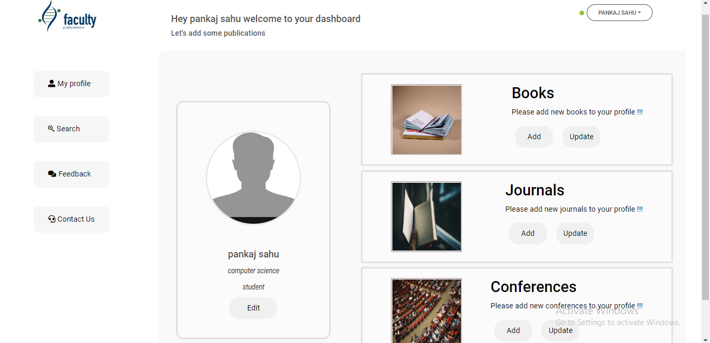
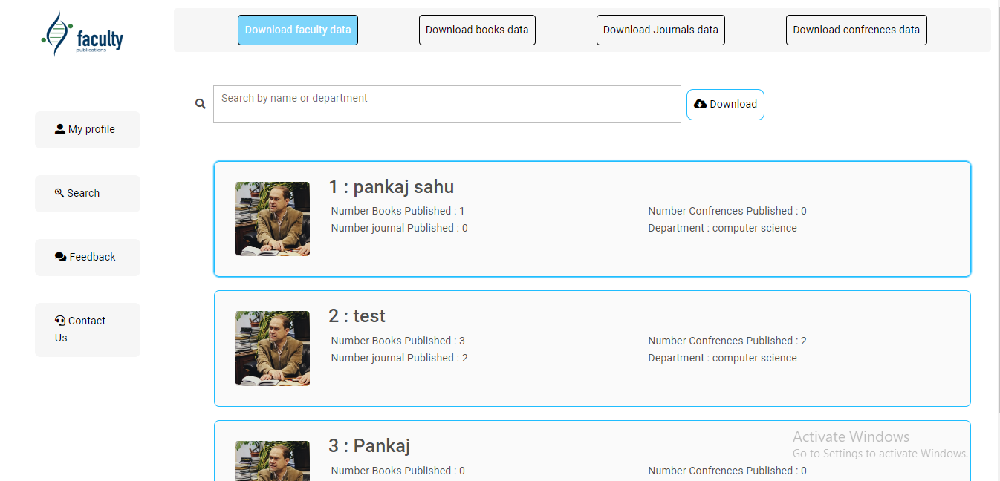
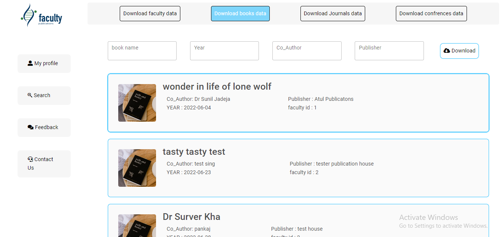
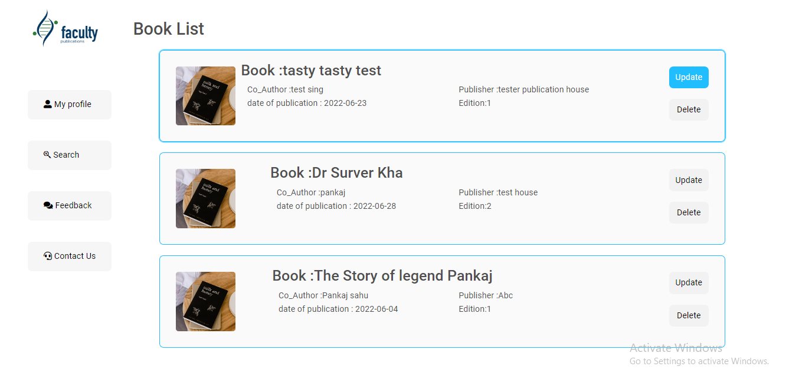
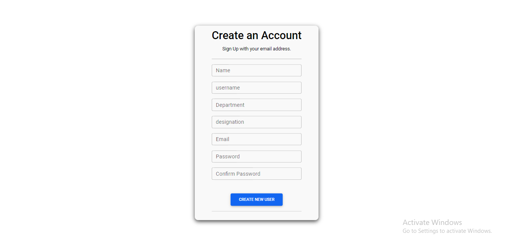
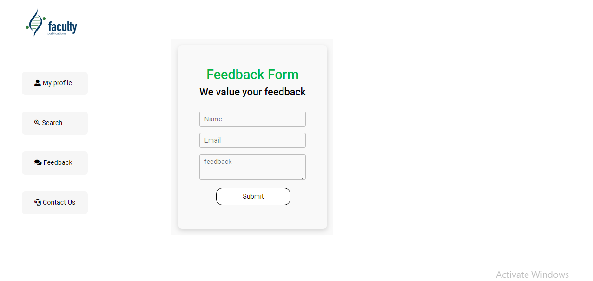
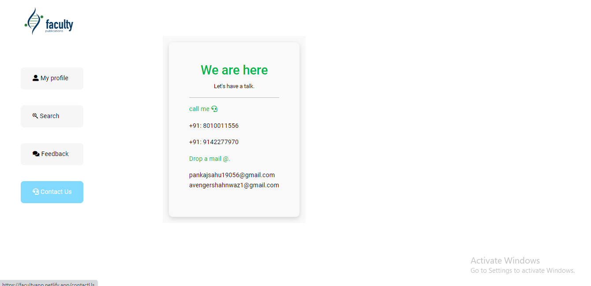

# faculty publication  ([link to website ](https://facultyapp.netlify.app/))

faculty publication management app for college faculty to manage their publication data faculty has his/her profile and he/she can do curd operation on his data 
,  django TOKEN authentication is used for accout login and DJANGO REST-FRAMEWORK is used to create api so that we can use api for various frontend !!!faculty publication management app for college faculty to manage their publication data faculty has his/her profile and he/she can do curd operation on his data django TOKEN authentication is used for accout login and DJANGO REST-FRAMEWORK is used to create api so that we can use api for various frontend !!!

## Features

- sign in page
- home page (user can add Publications)
- search page ( to search data of currently published publications and download in exel format)
- update page (here user can update delete his added publications)
- create new user page (register page)
- feedback page( if any user send feedback we will recive that feedback via email)
- contact us

## Screenshots
### sign in page

.png)
# home page

# search page ( to search data of currently published publications)

# update page (here user can update delete his added publications)

.png)

# create new user page (register page)

# feedback page( if any user send feedback we will recive that feedback via email)

# contact us

